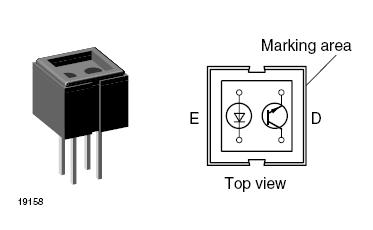
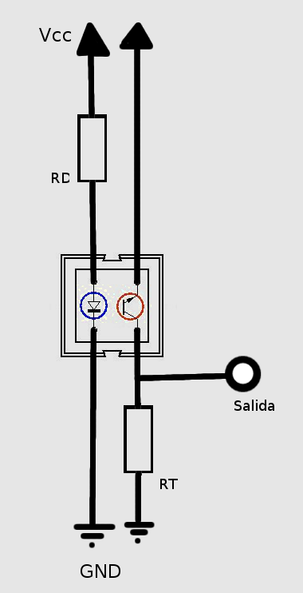
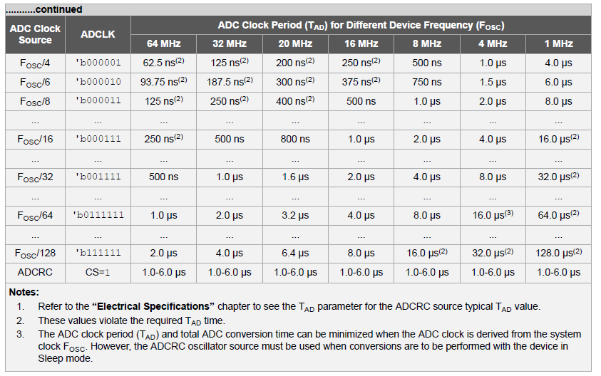
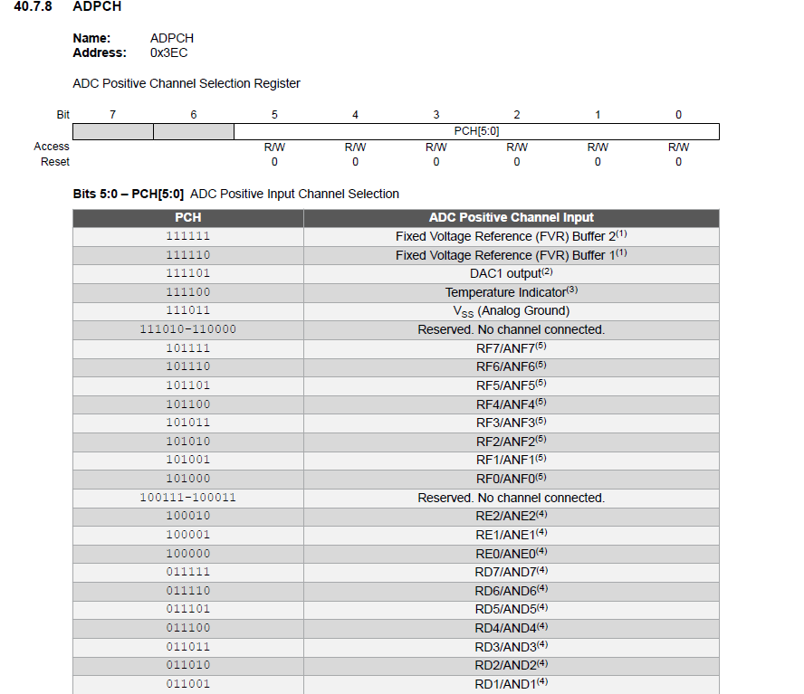

# Librería CNY70

## 1. Descripción general

La librería `CNY70` permite configurar y leer sensores analógicos conectados al ADC del microcontrolador PIC18F27/47/57Q43. Aunque está pensada para el sensor reflectivo CNY70, también puede usarse con una barrera infrarroja analógica formada por un LED IR emisor y un fototransistor receptor.

La librería permite trabajar con varios sensores analógicos en distintos canales ADC. Cuando se cambia de un canal a otro, realiza una descarga previa del capacitor interno de muestreo del ADC usando el canal interno `VSS / Analog Ground`.



---

## 2. Archivos de la librería

La librería está formada por dos archivos principales:

```c
CNY70.h
CNY70.c
```

También debe incluirse en el proyecto el archivo de configuración general del microcontrolador, por ejemplo:

```c
cabecera.h
```

La librería no configura el oscilador general del PIC. La frecuencia principal del microcontrolador debe configurarse en el archivo principal o en `cabecera.h`.

---

## 3. Funcionamiento del sensor

### 3.1 CNY70 en modo reflectivo

El CNY70 contiene internamente:

- Un LED infrarrojo emisor.
- Un fototransistor receptor.

El LED IR ilumina una superficie y el fototransistor recibe la luz reflejada.

Comportamiento típico:

```text
Superficie oscura  -> poca reflexión -> ADC bajo
Superficie clara   -> mayor reflexión -> ADC alto
```

Ejemplo de uso:

```text
Fondo negro frente al sensor -> ADC bajo
Objeto blanco frente al sensor -> ADC alto
```

En este caso se puede usar el modo:

```c
CNY70_ACTIVE_HIGH
```

---

### 3.2 Barrera IR analógica

También se puede usar la librería con una barrera IR analógica:

```text
LED IR  --->  objeto/pastilla  --->  fototransistor
```

Comportamiento típico:

```text
Haz libre       -> ADC alto
Haz bloqueado   -> ADC bajo
```

En este caso se puede usar el modo:

```c
CNY70_ACTIVE_LOW
```

---

## 4. Conexión recomendada

### 4.1 Conexión del LED infrarrojo

```text
VDD -> resistencia -> LED IR -> GND
```

Valores recomendados:

```text
220 ohm  -> corriente moderada
180 ohm  -> mayor intensidad
150 ohm  -> intensidad más alta
```

Para pruebas con 5 V, una resistencia entre `180 ohm` y `220 ohm` suele ser adecuada.

---

### 4.2 Conexión del fototransistor

Configuración recomendada para lectura analógica:

```text
Colector del fototransistor -> VDD
Emisor del fototransistor   -> pin ADC del PIC
Pin ADC                     -> resistencia RT -> GND
```

Ejemplo para RA3/AN3:

```text
Colector -> VDD
Emisor   -> RA3/AN3
RA3/AN3  -> RT -> GND
```

Valores posibles para `RT`:

```text
10 kΩ   -> menor sensibilidad, mayor estabilidad
40 kΩ   -> punto intermedio
47 kΩ   -> punto intermedio común
100 kΩ  -> mayor sensibilidad, más susceptible a ruido
```

---

## 5. Estructura de uso

La librería usa una estructura llamada `CNY70`:

```c
typedef struct
{
    volatile unsigned char *tris_reg;
    volatile unsigned char *ansel_reg;

    unsigned char pin_mask;
    unsigned char adc_channel;

} CNY70;
```

Cada sensor debe declararse como una variable de tipo `CNY70`.

Ejemplo:

```c
CNY70 sensorIR;
```

---

## 6. Inicialización del ADC

La librería incluye una función para configurar el ADC con reloj `FOSC/64`:

```c
CNY70_ADC_Init_FOSC64();
```

Esta función configura:

```c
ADREF
ADCLK
ADCON0
```
Configuración usada por la librería:

```c
ADREF = 0x00;
ADCLK = 0b011111;
ADCON0 = 0x84;
```

Con `FOSC = 64 MHz`:

```text
FADC = FOSC / (2 * (ADCLK + 1))
FADC = 64 MHz / (2 * (31 + 1))
FADC = 64 MHz / 64
FADC = 1 MHz
```


---

## 7. Descarga del capacitor interno del ADC

Cuando se usan varios sensores analógicos, el capacitor interno de muestreo del ADC puede quedar cargado con el voltaje del canal anterior.

Por ejemplo:

```text
Primero se lee AN3
Luego se cambia a AN4
```

El capacitor interno puede conservar parte de la carga del canal AN3 y afectar la primera lectura de AN4.

Para reducir este efecto, la librería descarga el capacitor usando el canal interno:

```c
CNY70_ADC_DISCHARGE_CHANNEL
```

Definido como:

```c
#define CNY70_ADC_DISCHARGE_CHANNEL  0x3B
```

Según la tabla `ADPCH` del PIC18F27/47/57Q43:

```text
VSS / Analog Ground = 0b111011 = 0x3B
```

La descarga solo se realiza cuando:

- Es la primera lectura.
- Se cambia de un canal ADC a otro.

Si se lee repetidamente el mismo canal, no se descarga el capacitor en cada lectura.

---

## 8. Funciones disponibles

### 8.1 `CNY70_ADC_Init_FOSC64`

```c
void CNY70_ADC_Init_FOSC64(void);
```

Configura el ADC para trabajar con `FOSC/64`.

Uso:

```c
CNY70_ADC_Init_FOSC64();
```

---

### 8.2 `CNY70_Init`

```c
void CNY70_Init(CNY70 *sensor,
                volatile unsigned char *tris,
                volatile unsigned char *ansel,
                unsigned char pin_mask,
                unsigned char adc_channel);
```

Configura el pin asociado al sensor como entrada analógica.

Ejemplo para RA3/AN3:

```c
CNY70_Init(&sensorIR, &TRISA, &ANSELA, 0x08, 0x03);
```

Donde:

```text
&TRISA  -> registro TRIS del puerto A
&ANSELA -> registro ANSEL del puerto A
0x08    -> máscara del pin RA3
0x03    -> canal AN3
```

---

### 8.3 `CNY70_Read`

```c
uint16_t CNY70_Read(CNY70 *sensor);
```

Lee el valor ADC del sensor indicado.

Ejemplo:

```c
resultado_ADC = CNY70_Read(&sensorIR);
```

La función devuelve un valor de 0 a 4095 si el ADC trabaja a 12 bits.

---

### 8.4 `CNY70_IsActive`

```c
uint8_t CNY70_IsActive(CNY70 *sensor,
                       uint16_t threshold,
                       uint8_t mode);
```

Evalúa si el sensor está activo según un umbral.

Ejemplo para barrera IR:

```c
if(CNY70_IsActive(&sensorIR, 750, CNY70_ACTIVE_LOW))
{
    // Haz bloqueado
}
```

Ejemplo para CNY70 reflectivo:

```c
if(CNY70_IsActive(&sensorCNY, 1300, CNY70_ACTIVE_HIGH))
{
    // Objeto claro detectado
}
```

---

### 8.5 `CNY70_ResetChannel`

```c
void CNY70_ResetChannel(void);
```

Fuerza a que la próxima lectura haga nuevamente la descarga del capacitor.

Debe usarse si en otra parte del programa se modificó `ADPCH` manualmente.

Ejemplo:

```c
ADPCH = 0x05;        // Cambio manual de canal
CNY70_ResetChannel();
```

---

## 9. Ejemplo básico con un sensor en RA3/AN3

```c
#include <xc.h>
#include <stdint.h>
#include "cabecera.h"
#include "LCD.h"
#include "CNY70.h"

#define UMBRAL_IR 750

CNY70 sensorIR;

unsigned int resultado_ADC = 0;

void configuro(void)
{
    OSCCON1 = 0x60;
    OSCFRQ  = 0x08;
    OSCEN   = 0x40;

    TRISD  = 0x00;
    ANSELD = 0x00;

    CNY70_ADC_Init_FOSC64();

    CNY70_Init(&sensorIR, &TRISA, &ANSELA, 0x08, 0x03);
}

void LCD_init(void)
{
    LCD_CONFIG();
    __delay_ms(16);
    BORRAR_LCD();
    CURSOR_HOME();
    CURSOR_ONOFF(OFF);
}

void main(void)
{
    configuro();
    LCD_init();

    while(1)
    {
        resultado_ADC = CNY70_Read(&sensorIR);

        POS_CURSOR(1, 0);
        ESCRIBE_MENSAJE("ADC:", 4);

        ENVIA_CHAR((resultado_ADC / 10000) + 0x30);
        ENVIA_CHAR(((resultado_ADC % 10000) / 1000) + 0x30);
        ENVIA_CHAR(((resultado_ADC % 1000) / 100) + 0x30);
        ENVIA_CHAR(((resultado_ADC % 100) / 10) + 0x30);
        ENVIA_CHAR((resultado_ADC % 10) + 0x30);

        ESCRIBE_MENSAJE("   ", 3);
    }
}
```

---

## 10. Ejemplo con dos sensores: RA3 y RA4

Este ejemplo usa:

```text
Sensor 1 -> RA3 / AN3
Sensor 2 -> RA4 / AN4
```

```c
CNY70 sensorA3;
CNY70 sensorA4;

unsigned int valor_A3 = 0;
unsigned int valor_A4 = 0;

void configuro(void)
{
    OSCCON1 = 0x60;
    OSCFRQ  = 0x08;
    OSCEN   = 0x40;

    TRISD  = 0x00;
    ANSELD = 0x00;

    CNY70_ADC_Init_FOSC64();

    CNY70_Init(&sensorA3, &TRISA, &ANSELA, 0x08, 0x03);
    CNY70_Init(&sensorA4, &TRISA, &ANSELA, 0x10, 0x04);
}
```

Lectura:

```c
valor_A3 = CNY70_Read(&sensorA3);
valor_A4 = CNY70_Read(&sensorA4);
```

Cuando se lee primero `sensorA3`, la librería detecta que es el primer canal usado y descarga el capacitor.

Cuando luego se lee `sensorA4`, la librería detecta que cambió de canal y vuelve a descargar el capacitor antes de leer AN4.

Si se vuelve a leer `sensorA4`, no se descarga otra vez porque el canal no cambió.

---

## 11. Ejemplo de conteo con barrera IR

```c
#define UMBRAL_IR 750

CNY70 sensorIR;

unsigned int resultado_ADC = 0;
unsigned int contador = 0;

unsigned char estado_bloqueado = 0;
unsigned char sistema_listo = 0;

while(1)
{
    resultado_ADC = CNY70_Read(&sensorIR);

    if(resultado_ADC <= UMBRAL_IR)
    {
        if((estado_bloqueado == 0) && (sistema_listo == 1))
        {
            contador++;
            estado_bloqueado = 1;
        }
    }
    else
    {
        sistema_listo = 1;
        estado_bloqueado = 0;
    }
}
```

Esta lógica evita que el contador incremente varias veces mientras el haz sigue bloqueado.

También evita el conteo falso inicial porque no cuenta hasta que el sistema haya visto primero el haz libre.

---

## 12. Recomendaciones de uso

- Usar un umbral intermedio entre el valor con haz libre y el valor con haz bloqueado.
- Para una barrera IR, el sensor suele ser activo en bajo.
- Para un CNY70 reflectivo con fondo negro y objeto blanco, el sensor suele ser activo en alto.
- Si se usan varios sensores analógicos, usar siempre `CNY70_Read()` para que la librería controle la descarga cuando cambia de canal.
- Si se modifica manualmente `ADPCH`, llamar luego a `CNY70_ResetChannel()`.
- Verificar que `CNY70_ADC_DISCHARGE_CHANNEL` corresponda a `VSS / Analog Ground` según el datasheet del PIC usado.

---

## 13. Valores de referencia usados en pruebas

Para una barrera IR analógica:

```text
Haz libre:       ADC aproximadamente 1970
Haz bloqueado:   ADC aproximadamente 680
Umbral usado:    750
```

Para CNY70 reflectivo los valores pueden ser menores porque el sensor recibe luz reflejada, no luz directa.

---

## 14. Notas importantes

La frecuencia del ADC se configura dentro de la librería mediante `ADCLK`.

La frecuencia general del PIC no se configura dentro de la librería. Debe configurarse en el archivo principal o en `cabecera.h`.

La descarga del capacitor no se realiza en cada lectura, solo cuando se cambia de canal ADC o cuando se hace la primera lectura.
