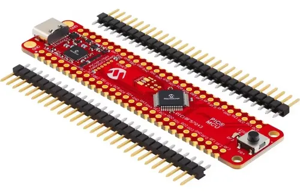
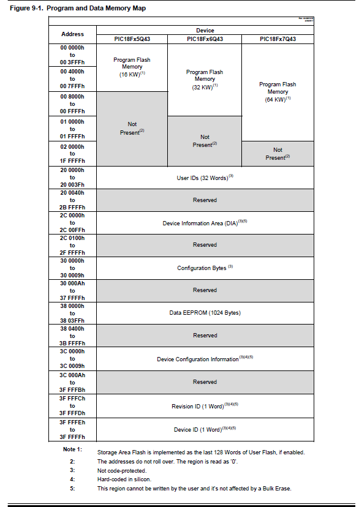

# Librería EPROM_DFM para PIC18F57Q43

## 1. Descripción general

`EPROM_DFM` es una librería desarrollada para el manejo de la memoria no volátil del microcontrolador **PIC18F57Q43** usando el compilador **XC8**.

Aunque comúnmente se le puede llamar memoria EEPROM, en este microcontrolador la hoja de datos la presenta como **DFM** (*Data Flash Memory*). Esta memoria permite guardar datos que deben conservarse incluso después de apagar o reiniciar el PIC.

La librería permite:

- Leer un byte desde la memoria DFM.
- Escribir un byte en una dirección de memoria DFM.
- Actualizar un byte solo si el dato cambió, reduciendo escrituras innecesarias.

Esta librería es útil para almacenar configuraciones, contadores, estados del sistema, valores de calibración o parámetros que deban mantenerse guardados.

---

## 2. Microcontrolador objetivo

Esta librería está pensada para:

```c
PIC18F57Q43
```


También puede servir como base para otros microcontroladores de la familia PIC18-Q43 que utilicen un módulo NVM similar, revisando previamente la hoja de datos correspondiente.

---

## 3. Memoria utilizada

El PIC18F57Q43 dispone de una zona de memoria no volátil llamada **DFM**.

| Característica | Valor |
|---|---|
| Tipo de memoria | Data Flash Memory |
| Uso práctico | EEPROM de datos |
| Tamaño | 1024 bytes |
| Dirección inicial real | `0x380000` |
| Dirección final real | `0x3803FF` |
| Acceso usado por la librería | Byte por byte |

El usuario no necesita trabajar directamente con direcciones del tipo `0x380000`. La librería permite usar direcciones lógicas simples.

Ejemplo:

| Dirección lógica usada | Dirección real en memoria |
|---|---|
| `0` | `0x380000` |
| `1` | `0x380001` |
| `10` | `0x38000A` |
| `1023` | `0x3803FF` |



---


## 4. Definiciones principales

```c
#define EEPROM_DFM_BASE      0x380000UL
#define EEPROM_DFM_SIZE      1024u
```

### `EEPROM_DFM_BASE`

Define la dirección real donde inicia la memoria DFM dentro del mapa de memoria del PIC.

```c
0x380000
```

### `EEPROM_DFM_SIZE`

Define el tamaño total disponible de la memoria DFM.

```c
1024 bytes
```

Por lo tanto, las direcciones lógicas válidas son:

```text
0 a 1023
```

---

## 5. Funciones disponibles

## 5.1 `EEPROM_ReadByte`

```c
uint8_t EEPROM_ReadByte(uint16_t address);
```

Lee un byte desde una dirección lógica de la memoria DFM.

### Parámetro

| Parámetro | Tipo | Descripción |
|---|---|---|
| `address` | `uint16_t` | Dirección lógica de memoria. Rango válido: `0` a `1023`. |

### Retorno

Devuelve el dato leído desde la memoria DFM.

```c
uint8_t dato;
dato = EEPROM_ReadByte(0);
```

Si la dirección está fuera del rango permitido, la función devuelve:

```c
0xFF
```

---

## 5.2 `EEPROM_WriteByte`

```c
void EEPROM_WriteByte(uint16_t address, uint8_t data);
```

Escribe un byte en una dirección lógica de la memoria DFM.

### Parámetros

| Parámetro | Tipo | Descripción |
|---|---|---|
| `address` | `uint16_t` | Dirección lógica de memoria. Rango válido: `0` a `1023`. |
| `data` | `uint8_t` | Dato de 8 bits que se desea guardar. |

### Ejemplo

```c
EEPROM_WriteByte(0, 25);
```

Este ejemplo guarda el valor `25` en la dirección lógica `0`, que internamente corresponde a la dirección real:

```text
0x380000
```

### Nota importante

Esta función escribe siempre el dato, incluso si el valor nuevo es igual al valor ya guardado.

---

## 5.3 `EEPROM_UpdateByte`

```c
void EEPROM_UpdateByte(uint16_t address, uint8_t data);
```

Actualiza un byte en la memoria DFM solo si el dato nuevo es diferente al dato ya almacenado.

### Parámetros

| Parámetro | Tipo | Descripción |
|---|---|---|
| `address` | `uint16_t` | Dirección lógica de memoria. Rango válido: `0` a `1023`. |
| `data` | `uint8_t` | Nuevo dato que se desea guardar. |

### Funcionamiento

La función realiza el siguiente proceso:

```text
1. Lee el dato actual de la dirección indicada.
2. Compara el dato leído con el dato nuevo.
3. Si son diferentes, escribe el nuevo dato.
4. Si son iguales, no realiza escritura.
```

### Ejemplo

```c
EEPROM_UpdateByte(0, 25);
```

Si en la dirección `0` ya estaba guardado el valor `25`, no se realiza una nueva escritura.

---

## 6. Diferencia entre `Write` y `Update`

| Función | Acción | Uso recomendado |
|---|---|---|
| `EEPROM_WriteByte()` | Escribe siempre | Cuando se desea forzar una escritura |
| `EEPROM_UpdateByte()` | Escribe solo si el dato cambió | Configuraciones, botones, contadores o parámetros |

Se recomienda usar `EEPROM_UpdateByte()` en la mayoría de casos, porque evita escrituras innecesarias y ayuda a reducir el desgaste de la memoria no volátil.

---

## 7. Forma de trabajo de la librería

El programa principal trabaja con direcciones lógicas simples:

```c
EEPROM_UpdateByte(0, dato);
EEPROM_UpdateByte(1, otro_dato);
```

La librería convierte internamente esas direcciones a la zona real de la DFM:

```c
real_address = EEPROM_DFM_BASE + address;
```

Ejemplo:

```c
address = 0
real_address = 0x380000 + 0
real_address = 0x380000
```

Luego esa dirección real se carga en los registros del módulo NVM:

```c
NVMADRU
NVMADRH
NVMADRL
```

---

## 8. Ejemplo básico de uso

```c
#include <xc.h>
#include <stdint.h>
#include "cabecera.h"
#include "EPROM_DFM.h"

#define ADDR_DATO 0

void main(void)
{
    uint8_t dato;

    dato = EEPROM_ReadByte(ADDR_DATO);

    if(dato == 0xFF)
    {
        dato = 0;
    }

    dato++;

    EEPROM_UpdateByte(ADDR_DATO, dato);

    while(1)
    {
        // Programa principal
    }
}
```

---

## 8. Ejemplo de uso con dos posiciones de memoria

```c
#define ADDR_DATO_0     0
#define ADDR_DATO_1     1

uint8_t valor0;
uint8_t valor1;

valor0 = EEPROM_ReadByte(ADDR_DATO_0);
valor1 = EEPROM_ReadByte(ADDR_DATO_1);

if(valor0 == 0xFF)
{
    valor0 = 0;
}

if(valor1 == 0xFF)
{
    valor1 = 0;
}

EEPROM_UpdateByte(ADDR_DATO_0, valor0);
EEPROM_UpdateByte(ADDR_DATO_1, valor1);
```


## 9. Recomendaciones de uso

- No escribir en la DFM dentro de un ciclo `while(1)` sin una condición.
- Usar `EEPROM_UpdateByte()` cuando el dato pueda repetirse.
- Guardar datos solo cuando sea necesario, por ejemplo al presionar un botón de confirmación.
- Verificar que la dirección usada esté dentro del rango `0` a `1023`.
- Recordar que una memoria vacía puede leerse como `0xFF`.
- No confundir `NVMDAT` con la memoria DFM. `NVMDAT` es un registro temporal del módulo NVM.

---

## 10. Ejemplo recomendado con botones

Una forma adecuada de uso es:

```text
RC0 -> modifica el valor en RAM
RC1 -> graba el valor en DFM
RC3 -> cambia la posición seleccionada
```

De esta forma, la memoria no se escribe cada vez que cambia el valor, sino solamente cuando el usuario confirma la grabación.

---

## 11. Limitaciones

- La librería trabaja originalmente con datos de 8 bits.
- Para datos de 16 bits se deben usar dos direcciones consecutivas.
- No debe usarse para guardar datos que cambien muy rápido o de forma continua.
- No reemplaza a una memoria externa si se requiere gran cantidad de escrituras frecuentes.

---

## 12. Notas finales

La memoria DFM del PIC18F57Q43 es útil para guardar información persistente sin usar componentes externos. Esta librería simplifica su uso al permitir trabajar con direcciones lógicas simples y funciones directas para lectura, escritura y actualización de datos.

El uso recomendado para proyectos académicos o de control es guardar configuraciones, contadores, valores de calibración o estados del sistema que deban conservarse después de apagar el equipo.
