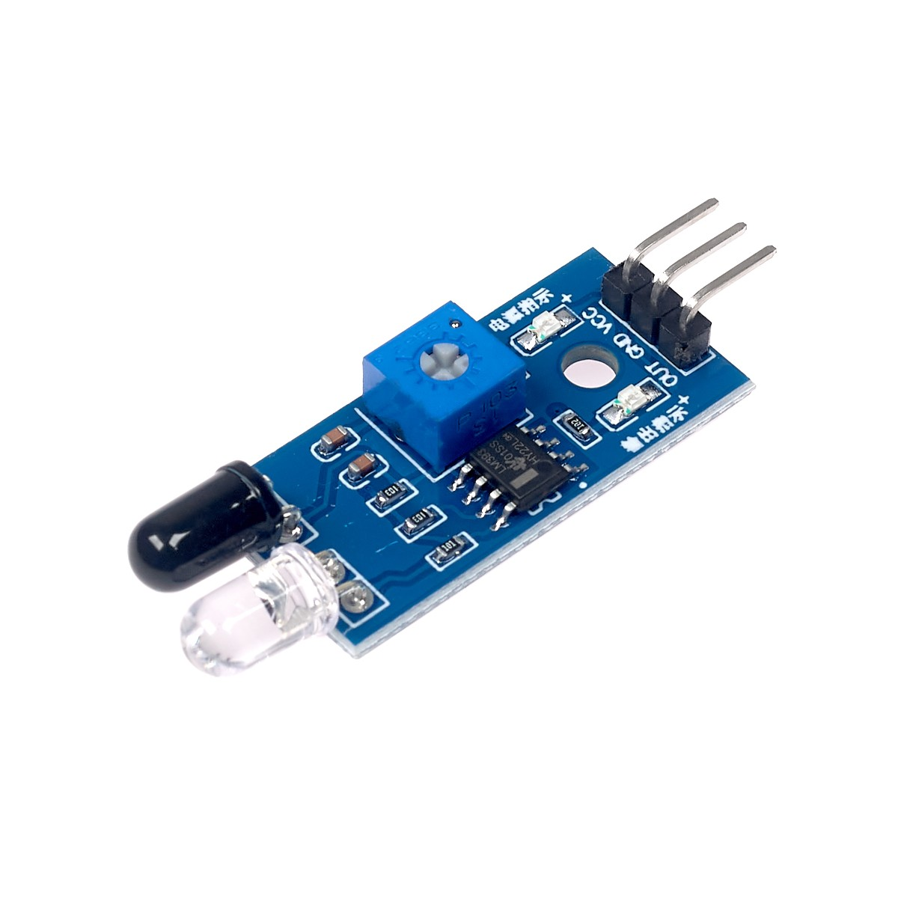

# Documentación de la librería `irsensor`

## Lectura de sensor infrarrojo digital con PIC18F57Q43

Esta documentación describe el funcionamiento, configuración y uso de la librería `irsensor`, desarrollada para la lectura de sensores infrarrojos digitales mediante el microcontrolador **PIC18F57Q43**, usando el compilador **XC8** en **MPLAB X IDE**.

Para el circuito y las pruebas del código se emplea el sensor infrarrojo digital **FC-51**, mostrado en la imagen de referencia. Este módulo es un sensor IR de obstáculo que integra un emisor infrarrojo, un receptor y un comparador **LM393**, entregando una señal digital de salida según la presencia o ausencia de un objeto frente al sensor.

La librería está orientada a sensores IR digitales con salida lógica, especialmente módulos como el **FC-51**. Su función principal es configurar el pin conectado a la salida digital del sensor como entrada digital y permitir al usuario interpretar la lectura según el comportamiento del módulo. En este tipo de sensores, la salida puede trabajar como **activo en bajo** o **activo en alto**, por lo que la librería incluye funciones separadas para ambos casos.


---

## Archivos de la librería

La librería está compuesta por dos archivos principales:

```text
IRsensor.h
IRsensor.c
```

### `IRsensor.h`

Contiene:

- Definición de la estructura `IRsensor`.
- Prototipo de la función de inicialización.
- Prototipos de las funciones de lectura.
- Documentación general de uso de la librería.

### `IRsensor.c`

Contiene:

- Implementación de la inicialización del sensor.
- Configuración del pin como entrada digital.
- Lectura del sensor cuando es activo en bajo.
- Lectura del sensor cuando es activo en alto.

---

## Objetivo de la librería

El objetivo de esta librería es ordenar y simplificar la lectura de sensores infrarrojos digitales dentro del proyecto, evitando configurar manualmente los registros `PORT`, `TRIS` y `ANSEL` cada vez que se use un sensor.

La librería permite:

- Seleccionar el puerto del microcontrolador donde se conecta el sensor.
- Seleccionar el pin mediante una máscara.
- Configurar el pin como entrada digital.
- Leer sensores que detectan con nivel bajo.
- Leer sensores que detectan con nivel alto.
- Usar varios sensores mediante estructuras independientes.

---

## Consideración de hardware

Un sensor infrarrojo digital entrega una señal lógica en su pin de salida. Esta señal puede ser:

```text
0 lógico
1 lógico
```

Dependiendo del módulo, la detección puede representarse de dos formas:

```text
Activo en bajo:
0 = detecta
1 = no detecta

Activo en alto:
1 = detecta
0 = no detecta
```

Muchos módulos IR basados en LM393 suelen trabajar como **activos en bajo**, es decir, entregan `0` cuando detectan un objeto. Sin embargo, esto puede variar según el módulo, el ajuste del potenciómetro, el tipo de sensor o la configuración del circuito.

Por esta razón, la librería proporciona dos funciones distintas de lectura:

```c
IRSensor_ReadActiveLow();
IRSensor_ReadActiveHigh();
```

De esta forma, el usuario puede elegir la función adecuada sin tener que definir el tipo de activación durante la inicialización.

---

## Conexión básica del sensor

Ejemplo usando un sensor conectado al pin `RD0`:

```text
Sensor IR         PIC18F57Q43
VCC        ->     5 V o 3.3 V, según el módulo
GND        ->     GND
OUT        ->     RD0
```

La tierra del sensor y la tierra del PIC deben estar conectadas en común.

---

## Estructura `IRsensor`

La librería utiliza una estructura para guardar la configuración del sensor:

```c
typedef struct
{
    volatile uint8_t *port;
    volatile uint8_t *tris;
    volatile uint8_t *ansel;

    uint8_t pin_mask;

} IRsensor;
```

Cada sensor que se use en el programa debe tener su propia variable de tipo `IRsensor`.

Ejemplo:

```c
IRsensor sensor_ir;
```

Si se usan varios sensores:

```c
IRsensor sensor_entrada;
IRsensor sensor_salida;
IRsensor sensor_conteo;
```

---

## Campos de la estructura

### `port`

```c
volatile uint8_t *port;
```

Guarda la dirección del registro `PORT` del puerto usado.

El registro `PORT` se utiliza para leer el estado lógico real del pin.

Ejemplo:

```c
&PORTD
```

Si el sensor está conectado al puerto D, se debe pasar `&PORTD`.

---

### `tris`

```c
volatile uint8_t *tris;
```

Guarda la dirección del registro `TRIS` del puerto usado.

El registro `TRIS` configura si un pin será entrada o salida.

```text
TRIS = 0 -> salida
TRIS = 1 -> entrada
```

Como el sensor es una entrada, el bit correspondiente debe configurarse en `1`.

Ejemplo:

```c
&TRISD
```

---

### `ansel`

```c
volatile uint8_t *ansel;
```

Guarda la dirección del registro `ANSEL` del puerto usado.

El registro `ANSEL` configura si un pin trabaja como analógico o digital.

```text
ANSEL = 0 -> digital
ANSEL = 1 -> analógico
```

Como el sensor entrega una señal digital, el pin debe configurarse como digital.

Ejemplo:

```c
&ANSELD
```

---

### `pin_mask`

```c
uint8_t pin_mask;
```

Guarda la máscara del pin donde está conectado el sensor.

Ejemplos para el puerto D:

```text
RD0 -> 0x01
RD1 -> 0x02
RD2 -> 0x04
RD3 -> 0x08
RD4 -> 0x10
RD5 -> 0x20
RD6 -> 0x40
RD7 -> 0x80
```

Si el sensor está conectado a `RD0`, se usa:

```c
0x01
```

Si el sensor está conectado a `RD2`, se usa:

```c
0x04
```


## Funciones públicas de la librería

### `IRSensor_Init()`

```c
void IRSensor_Init(IRsensor *sensor,
                   volatile uint8_t *port,
                   volatile uint8_t *tris,
                   volatile uint8_t *ansel,
                   uint8_t pin_mask);
```

Inicializa el sensor, configura el pin como entrada digital y guarda los registros necesarios dentro de la estructura.

Ejemplo usando `RD0`:

```c
IRSensor_Init(&sensor_ir,
              &PORTD,
              &TRISD,
              &ANSELD,
              0x01);
```

---

### `IRSensor_ReadActiveLow()`

```c
uint8_t IRSensor_ReadActiveLow(IRsensor *sensor);
```

Lee el sensor considerando que detecta cuando el pin está en nivel bajo.

```text
Pin = 0 -> detecta
Pin = 1 -> no detecta
```

Retorna:

```text
1 -> detecta
0 -> no detecta
```

Ejemplo:

```c
if(IRSensor_ReadActiveLow(&sensor_ir))
{
    /*
     * El sensor detecta.
     */
}
else
{
    /*
     * El sensor no detecta.
     */
}
```

---

### `IRSensor_ReadActiveHigh()`

```c
uint8_t IRSensor_ReadActiveHigh(IRsensor *sensor);
```

Lee el sensor considerando que detecta cuando el pin está en nivel alto.

```text
Pin = 1 -> detecta
Pin = 0 -> no detecta
```

Retorna:

```text
1 -> detecta
0 -> no detecta
```

Ejemplo:

```c
if(IRSensor_ReadActiveHigh(&sensor_ir))
{
    /*
     * El sensor detecta.
     */
}
else
{
    /*
     * El sensor no detecta.
     */
}
```

---

## Ejemplo de uso en `maincode.c`

El siguiente ejemplo usa un sensor infrarrojo digital conectado a `RD0` y un LED de prueba conectado a `RD1`.

```c
#include "cabecera.h"
#include "IRsensor.h"

IRsensor sensor_ir;

void config(void)
{
    /*
     * Configuración del oscilador interno.
     */
    OSCON1 = 0x60;
    OSCFRQ = 0x07;
    OSCEN  = 0x40;

    /*
     * RD1 como salida digital para LED de prueba.
     */
    ANSELDbits.ANSELD1 = 0;
    TRISDbits.TRISD1 = 0;
    LATDbits.LATD1 = 0;
}

void main(void)
{
    config();

    /*
     * Inicialización del sensor infrarrojo digital.
     *
     * Sensor conectado a RD0.
     */
    IRSensor_Init(&sensor_ir,
                  &PORTD,
                  &TRISD,
                  &ANSELD,
                  0x01);

    while(1)
    {
        /*
         * Muchos módulos IR con LM393 son activos en bajo.
         * Por ello, se usa IRSensor_ReadActiveLow().
         */
        if(IRSensor_ReadActiveLow(&sensor_ir))
        {
            /*
             * El sensor detecta.
             */
            LATDbits.LATD1 = 1;
        }
        else
        {
            /*
             * El sensor no detecta.
             */
            LATDbits.LATD1 = 0;
        }
    }
}
```

---

## Ejemplo con sensor activo en alto

Si el módulo entrega `1` cuando detecta, se usa `IRSensor_ReadActiveHigh()`:

```c
while(1)
{
    if(IRSensor_ReadActiveHigh(&sensor_ir))
    {
        /*
         * El sensor detecta.
         */
        LATDbits.LATD1 = 1;
    }
    else
    {
        /*
         * El sensor no detecta.
         */
        LATDbits.LATD1 = 0;
    }
}
```

---

## Uso con varios sensores

La librería permite usar varios sensores creando una estructura independiente para cada uno.

Ejemplo:

```c
IRsensor sensor_entrada;
IRsensor sensor_salida;

IRSensor_Init(&sensor_entrada,
              &PORTD,
              &TRISD,
              &ANSELD,
              0x01);   // RD0

IRSensor_Init(&sensor_salida,
              &PORTD,
              &TRISD,
              &ANSELD,
              0x02);   // RD1
```

Lectura:

```c
if(IRSensor_ReadActiveLow(&sensor_entrada))
{
    /*
     * Sensor de entrada detecta.
     */
}

if(IRSensor_ReadActiveLow(&sensor_salida))
{
    /*
     * Sensor de salida detecta.
     */
}
```

---

## Tabla de máscaras de pines

Ejemplo para el puerto D:

| Pin | Máscara |
|---|---:|
| RD0 | `0x01` |
| RD1 | `0x02` |
| RD2 | `0x04` |
| RD3 | `0x08` |
| RD4 | `0x10` |
| RD5 | `0x20` |
| RD6 | `0x40` |
| RD7 | `0x80` |

La misma lógica se aplica a otros puertos:

```c
&PORTB, &TRISB, &ANSELB
&PORTC, &TRISC, &ANSELC
&PORTD, &TRISD, &ANSELD
```

---

## Recomendaciones de uso

- Usar `PORTx` para leer entradas digitales.
- No usar `LATx` para leer sensores de entrada.
- Configurar el pin como digital mediante `ANSEL`.
- Configurar el pin como entrada mediante `TRIS`.
- Verificar si el sensor es activo en bajo o activo en alto antes de elegir la función de lectura.
- Usar resistencias, alimentación y tierra común según el módulo utilizado.
- Si el sensor tiene potenciómetro, calibrarlo antes de usarlo en el programa.

---

## Diferencia entre activo en bajo y activo en alto

### Sensor activo en bajo

```text
Detecta    -> 0
No detecta -> 1
```

Función recomendada:

```c
IRSensor_ReadActiveLow(&sensor_ir);
```

### Sensor activo en alto

```text
Detecta    -> 1
No detecta -> 0
```

Función recomendada:

```c
IRSensor_ReadActiveHigh(&sensor_ir);
```

---

## Resumen

La librería `IRsensor` permite leer sensores infrarrojos digitales de forma ordenada y reutilizable. Su diseño se basa en una estructura `IRsensor`, donde se guardan los registros del puerto y la máscara del pin usado.

La librería proporciona dos funciones de lectura para adaptarse a distintos tipos de sensores:

```c
IRSensor_ReadActiveLow();
IRSensor_ReadActiveHigh();
```

Con esto, el usuario puede leer sensores activos en bajo o activos en alto sin modificar la inicialización ni el código interno de la librería.
