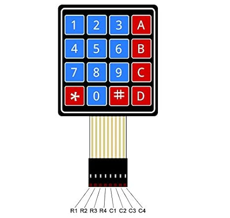

# Documentación de la librería `Keypad4x4`

## Descripción general

La librería `Keypad4x4` permite utilizar un teclado matricial de **4 filas por 4 columnas** con el microcontrolador **PIC18F57Q43**.

La librería realiza automáticamente el barrido de filas, la lectura de columnas, el antirrebote mecánico y la espera de liberación de la tecla. De esta manera, una pulsación prolongada se registra una sola vez.

La distribución de pines está definida dentro de la librería:



```text
Px0 -> Fila 1
Px1 -> Fila 2
Px2 -> Fila 3
Px3 -> Fila 4

Px4 -> Columna 1
Px5 -> Columna 2
Px6 -> Columna 3
Px7 -> Columna 4
```

La letra `x` representa el puerto seleccionado. Por ejemplo, al utilizar el puerto C:

```text
RC0-RC3 -> Filas
RC4-RC7 -> Columnas
```

---

## Aplicaciones

La librería puede emplearse en:

- Sistemas de dispensación automática.
- Menús de configuración.
- Ingreso de claves.
- Selección de opciones.
- Interfaces con pantalla LCD.
- Sistemas de control de acceso.

En el proyecto de dispensación de pastillas, el teclado puede utilizarse para ingresar cantidades, seleccionar compartimientos, confirmar operaciones o navegar por menús.

---

## Distribución del teclado

La librería utiliza la distribución estándar:

```text
        C1   C2   C3   C4
      +----+----+----+----+
F1    | 1  | 2  | 3  | A  |
      +----+----+----+----+
F2    | 4  | 5  | 6  | B  |
      +----+----+----+----+
F3    | 7  | 8  | 9  | C  |
      +----+----+----+----+
F4    | *  | 0  | #  | D  |
      +----+----+----+----+
```

Cada tecla conecta una fila con una columna.

---

## Principio de funcionamiento

Las filas se configuran como salidas digitales y las columnas como entradas digitales con resistencias pull-up.

La secuencia de lectura es:

1. Todas las filas se mantienen inicialmente en alto.
2. Se coloca una fila en bajo.
3. Se leen las cuatro columnas.
4. Si una columna pasa a bajo, se identifica la tecla.
5. Se aplica antirrebote.
6. Se confirma la misma tecla.
7. Se espera a que la tecla sea liberada.
8. Se retorna el carácter.

---

## Archivos de la librería

```text
Keypad4x4.h
Keypad4x4.c
```

`Keypad4x4.h` contiene las definiciones, estructura y prototipos.

`Keypad4x4.c` contiene las máscaras, mapa de teclas, funciones internas, inicialización y lectura.

---

## Definiciones principales

```c
#define KEYPAD_ROWS        4
#define KEYPAD_COLUMNS     4
#define KEYPAD_NO_KEY      '\0'
#define KEYPAD_DEBOUNCE_MS 20
```

`KEYPAD_NO_KEY` indica que no hay ninguna tecla presionada.

`KEYPAD_DEBOUNCE_MS` define el tiempo de antirrebote.

---

## Estructura `Keypad`

```c
typedef struct
{
    volatile uint8_t *port;
    volatile uint8_t *lat;
    volatile uint8_t *tris;
    volatile uint8_t *ansel;
    volatile uint8_t *wpu;

} Keypad;
```

### `port`

Dirección del registro `PORT`. Se utiliza para leer las columnas.

### `lat`

Dirección del registro `LAT`. Se utiliza para controlar las filas.

### `tris`

Dirección del registro `TRIS`. Configura las filas como salidas y las columnas como entradas.

### `ansel`

Dirección del registro `ANSEL`. Configura los pines como digitales.

### `wpu`

Dirección del registro de resistencias pull-up. Activa los pull-up internos de las columnas.

---

## Máscaras internas

Las filas usan:

```c
static const uint8_t Keypad_RowMasks[KEYPAD_ROWS] =
{
    0x01,
    0x02,
    0x04,
    0x08
};
```

Las columnas usan:

```c
static const uint8_t Keypad_ColumnMasks[KEYPAD_COLUMNS] =
{
    0x10,
    0x20,
    0x40,
    0x80
};
```

Por ello, la conexión obligatoria es:

```text
Bits 0 a 3 -> filas
Bits 4 a 7 -> columnas
```

---

## Mapa de teclas

```c
static const char Keypad_Map[KEYPAD_ROWS][KEYPAD_COLUMNS] =
{
    {'1', '2', '3', 'A'},
    {'4', '5', '6', 'B'},
    {'7', '8', '9', 'C'},
    {'*', '0', '#', 'D'}
};
```

---

## Función `Keypad_Init`

```c
void Keypad_Init(Keypad *keypad,
                 volatile uint8_t *port,
                 volatile uint8_t *lat,
                 volatile uint8_t *tris,
                 volatile uint8_t *ansel,
                 volatile uint8_t *wpu);
```

La función:

1. Guarda las direcciones de los registros.
2. Configura el puerto como digital.
3. Configura los bits 0 a 3 como salidas.
4. Configura los bits 4 a 7 como entradas.
5. Activa las resistencias pull-up de las columnas.
6. Coloca todas las filas en alto.

Ejemplo con el puerto C:

```c
Keypad_Init(&teclado,
            &PORTC,
            &LATC,
            &TRISC,
            &ANSELC,
            &WPUC);
```

---

## Función `Keypad_Read`

```c
char Keypad_Read(Keypad *keypad);
```

La función realiza el barrido, confirma la tecla, aplica antirrebote y espera a que el usuario la libere.

Puede retornar:

```text
'0' a '9'
'A' a 'D'
'*'
'#'
```

Cuando no hay tecla:

```c
KEYPAD_NO_KEY
```

Ejemplo:

```c
char tecla;

tecla = Keypad_Read(&teclado);

if(tecla != KEYPAD_NO_KEY)
{
    /*
     * Se detectó una tecla válida.
     */
}
```

---

## Espera de liberación

La secuencia es:

```text
Detectar tecla
     |
Esperar 20 ms
     |
Confirmar tecla
     |
Esperar liberación
     |
Esperar 20 ms
     |
Retornar carácter
```

Aunque el usuario mantenga presionada una tecla, esta se registra una sola vez.

---

## Conexión recomendada con puerto C

```text
Teclado 4x4              PIC18F57Q43
------------------------------------------------
Fila 1                   RC0
Fila 2                   RC1
Fila 3                   RC2
Fila 4                   RC3

Columna 1                RC4
Columna 2                RC5
Columna 3                RC6
Columna 4                RC7
```

Las columnas usan resistencias pull-up internas. También pueden emplearse resistencias externas de aproximadamente `10 kΩ` hacia `VDD`.

---

## Identificación de terminales

El orden físico del conector puede variar según el fabricante. Para identificar filas y columnas se recomienda:

- Consultar la hoja de datos.
- Usar un multímetro en modo continuidad.
- Presionar una tecla y verificar qué dos terminales se conectan.

---

## Ejemplo completo con LCD

```c
#include <xc.h>
#include <stdint.h>

#include "cabecera.h"
#include "Keypad4x4.h"
#include "LCD.h"

Keypad teclado;
char tecla;

void configuro(void)
{
    OSCCON1 = 0x60;
    OSCFRQ  = 0x08;
    OSCEN   = 0x40;

    ANSELD = 0x00;
    LATD   = 0x00;
}

void main(void)
{
    configuro();

    LCD_CONFIG();
    BORRAR_LCD();

    Keypad_Init(&teclado,
                &PORTC,
                &LATC,
                &TRISC,
                &ANSELC,
                &WPUC);

    POS_CURSOR(1, 0);
    ESCRIBE_MENSAJE("Tecla:", 6);

    POS_CURSOR(2, 0);
    ENVIA_CHAR('-');

    while(1)
    {
        tecla = Keypad_Read(&teclado);

        if(tecla != KEYPAD_NO_KEY)
        {
            POS_CURSOR(2, 0);
            ENVIA_CHAR((unsigned char)tecla);
            ESCRIBE_MENSAJE("               ", 15);
        }
    }
}
```

---

## Conversión de carácter a número

Las teclas numéricas retornan caracteres. Para convertirlas:

```c
uint8_t numero;

if(tecla >= '0' && tecla <= '9')
{
    numero = (uint8_t)(tecla - '0');
}
```

---

## Limitaciones

- Diseñada para teclados 4x4.
- Usa un puerto completo.
- Filas obligatoriamente en bits 0 a 3.
- Columnas obligatoriamente en bits 4 a 7.
- Se recomienda una sola tecla a la vez.
- La función espera la liberación después de detectar una tecla.
- No implementa detección múltiple.
- Puede existir ghosting con varias teclas simultáneas.

---

## Recomendaciones

- Verificar el orden real de filas y columnas.
- Utilizar cables cortos.
- No compartir el puerto con otros periféricos.
- Confirmar que `_XTAL_FREQ` sea correcto.
- Utilizar resistencias pull-up externas si existe ruido.
- Presionar una sola tecla a la vez.

---

## Notas finales

Cuando no hay teclas presionadas, `Keypad_Read()` retorna inmediatamente `KEYPAD_NO_KEY`.

Cuando detecta una tecla válida, espera a que sea liberada antes de devolver el carácter. Este comportamiento evita lecturas repetidas por una pulsación prolongada.
