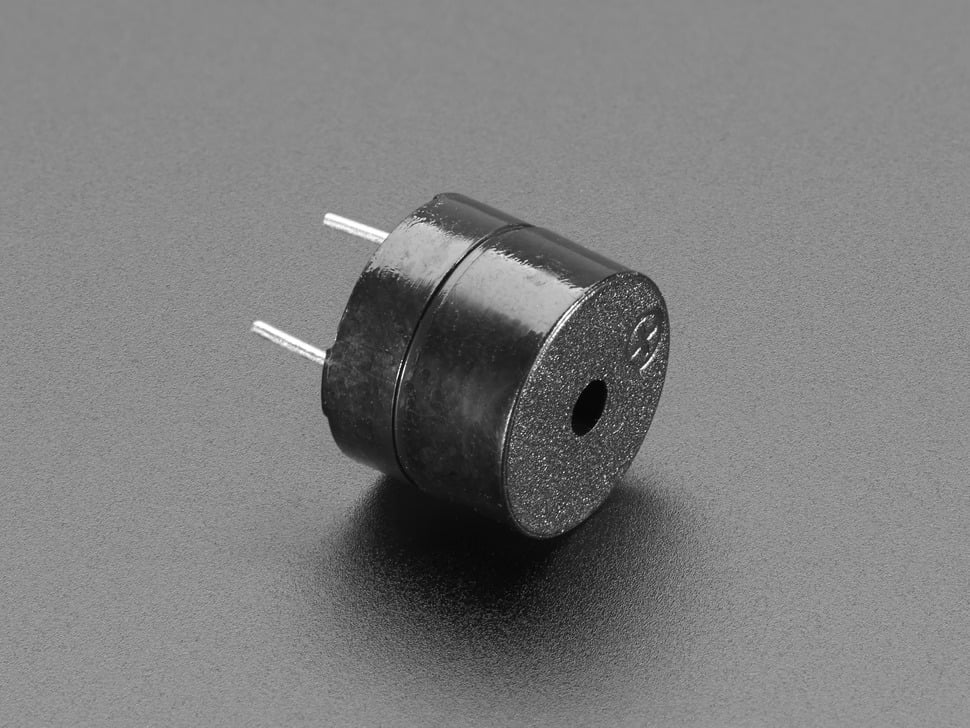
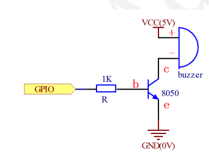

# Documentación de la librería `Libbuzzer`

## Descripción general

La librería `Libbuzzer` permite controlar un **buzzer pasivo** mediante un pin digital del microcontrolador **PIC18F57Q43**, usando el compilador **XC8** en **MPLAB X IDE**.

La librería genera tonos mediante software, alternando el estado lógico del pin conectado al buzzer. Esto permite crear sonidos personalizados para diferentes eventos del sistema, como confirmaciones, errores, advertencias o pulsaciones de botones.

Esta librería sigue una estructura modular: el usuario puede seleccionar el puerto y pin donde se conecta el buzzer mediante punteros a los registros `LAT`, `TRIS` y `ANSEL`, junto con una máscara de pin.


---

## Aplicación dentro del sistema

Esta librería está orientada a un sistema de entrega o dispensación automática de pastillas. Por ello, incluye sonidos diferenciados para eventos comunes del sistema:

- Click de botón.
- Confirmación final corta.
- Entrega correcta.
- Advertencia.
- Error.

El objetivo es que el usuario pueda identificar auditivamente el estado del sistema sin necesidad de observar constantemente la pantalla o los indicadores visuales.

---

## Archivos de la librería

La librería está compuesta por dos archivos principales:

```text
Libbuzzer.h
Libbuzzer.c
```

El archivo `Libbuzzer.h` contiene las definiciones, estructura y prototipos de funciones.

El archivo `Libbuzzer.c` contiene la implementación de las funciones.

---

## Consideraciones sobre el buzzer

La librería está pensada principalmente para un **buzzer pasivo**, ya que este tipo de buzzer permite generar diferentes tonos dependiendo de la frecuencia de la señal aplicada.

Un buzzer pasivo no genera sonido por sí solo al recibir un nivel lógico fijo. Requiere una señal alternada, por ejemplo una señal cuadrada. Esta librería genera dicha señal mediante software.

---

## Recomendación de circuito

No se recomienda conectar el buzzer directamente al pin del microcontrolador si el consumo del buzzer es mayor al que el pin puede entregar de forma segura.

Para el circuito se recomienda utilizar un transistor **BC548** como etapa de conmutación entre el pin del microcontrolador y el buzzer. De esta manera, el pin del PIC solo controla la base del transistor, mientras que la corriente principal del buzzer es suministrada por la fuente de alimentación.

### Conexión recomendada con transistor BC548

```text
PIC18F57Q43
Pin de control ---- Resistencia de base ---- Base BC548

Emisor BC548 ---- GND

Colector BC548 ---- Terminal negativo del buzzer

Terminal positivo del buzzer ---- VCC

```

### Componentes recomendados

```text
Buzzer pasivo
Transistor NPN BC548
Resistencia de base entre 1 kΩ y 4.7 kΩ
Fuente de alimentación adecuada para el buzzer
GND común entre el PIC y la fuente del buzzer
```

### Consideraciones importantes

El emisor del BC548 debe conectarse a tierra. El colector se conecta al terminal negativo del buzzer. El terminal positivo del buzzer se conecta a la alimentación correspondiente.

El pin del microcontrolador debe conectarse a la base del transistor mediante una resistencia. Esta resistencia limita la corriente de base y protege el pin del PIC.

Si el buzzer utilizado es inductivo o electromagnético, se recomienda colocar un diodo de protección en paralelo con el buzzer para reducir picos de voltaje. En buzzers piezoeléctricos pequeños, normalmente esto no es crítico, pero puede considerarse como medida de protección.

---

## Dependencias

La librería requiere incluir el archivo de configuración principal del proyecto:

```c
#include "cabecera.h"
```

En este archivo debe estar definida la frecuencia del sistema mediante:

```c
#define _XTAL_FREQ 64000000UL
```

o el valor correspondiente a la frecuencia real configurada en el microcontrolador.

Esto es necesario porque la librería utiliza funciones de retardo como:

```c
__delay_us();
__delay_ms();
```

---

## Definición de notas musicales

En el archivo `Libbuzzer.h` se definen algunas frecuencias musicales que se utilizan en los sonidos predefinidos.

```c
#define NOTE_C4   262
#define NOTE_D4   294
#define NOTE_E4   330
#define NOTE_G4   392
#define NOTE_A4   440

#define NOTE_C5   523
#define NOTE_D5   587
#define NOTE_E5   659
#define NOTE_F5   698
#define NOTE_G5   784
#define NOTE_A5   880
#define NOTE_B5   988

#define NOTE_C6   1047
```

Los valores están expresados en Hertz.

---

## Estructura `Buzzer`

La estructura `Buzzer` almacena la configuración del pin donde se conecta el buzzer.

```c
typedef struct
{
    volatile uint8_t *lat;
    volatile uint8_t *tris;
    volatile uint8_t *ansel;

    uint8_t pin_mask;

} Buzzer;
```

### Campo `lat`

```c
volatile uint8_t *lat;
```

Guarda la dirección del registro `LAT` del puerto utilizado. El registro `LAT` se usa para escribir el estado lógico del pin.

Ejemplo:

```c
&LATA
```

### Campo `tris`

```c
volatile uint8_t *tris;
```

Guarda la dirección del registro `TRIS` del puerto utilizado. El registro `TRIS` permite configurar el pin como entrada o salida.

En los registros `TRIS`:

```text
0 = salida
1 = entrada
```

### Campo `ansel`

```c
volatile uint8_t *ansel;
```

Guarda la dirección del registro `ANSEL` del puerto utilizado. El registro `ANSEL` permite configurar el pin como analógico o digital.

En los registros `ANSEL`:

```text
0 = digital
1 = analógico
```

Para controlar un buzzer, el pin debe estar configurado como digital.

### Campo `pin_mask`

```c
uint8_t pin_mask;
```

Guarda la máscara del pin donde está conectado el buzzer.

Ejemplos:

```text
RA0 -> 0x01
RA1 -> 0x02
RA2 -> 0x04
RA3 -> 0x08

RB0 -> 0x01
RB1 -> 0x02
RB2 -> 0x04
RB3 -> 0x08
```

---

## Función `Buzzer_Init`

```c
void Buzzer_Init(Buzzer *buzzer,
                 volatile uint8_t *lat,
                 volatile uint8_t *tris,
                 volatile uint8_t *ansel,
                 uint8_t pin_mask);
```

Inicializa el pin asociado al buzzer.

La función realiza las siguientes acciones:

1. Guarda las direcciones de los registros del puerto.
2. Guarda la máscara del pin seleccionado.
3. Configura el pin como digital.
4. Configura el pin como salida.
5. Deja el buzzer inicialmente apagado.

### Ejemplo

```c
Buzzer buzzer1;

Buzzer_Init(&buzzer1, &LATA, &TRISA, &ANSELA, 0x01);
```

Este ejemplo inicializa un buzzer conectado al pin `RA0`.

---

## Función `Buzzer_Tone`

```c
void Buzzer_Tone(Buzzer *buzzer,
                 uint16_t freq,
                 uint16_t time_ms,
                 uint8_t duty);
```

Genera un tono en el buzzer.

La función alterna el pin entre alto y bajo para generar una señal cuadrada. La frecuencia define el periodo de la señal, y el ciclo de trabajo define qué porcentaje del periodo permanece en nivel alto.

### Parámetros

`buzzer`: dirección de la estructura asociada al buzzer.

`freq`: frecuencia del tono en Hertz.

`time_ms`: duración del tono en milisegundos.

`duty`: ciclo de trabajo en porcentaje.

Valores recomendados:

```text
50 %  -> tono equilibrado
60 %  -> tono con mayor presencia
70 %  -> útil para error o alerta
```

### Ejemplo

```c
Buzzer_Tone(&buzzer1, 1000, 200, 50);
```

Este ejemplo genera un tono de 1000 Hz durante 200 ms con 50 % de ciclo de trabajo.

---

## Función `Buzzer_Off`

```c
void Buzzer_Off(Buzzer *buzzer);
```

Apaga el buzzer colocando su pin en estado bajo.

### Ejemplo

```c
Buzzer_Off(&buzzer1);
```

---

## Función `Buzzer_ButtonClick`

```c
void Buzzer_ButtonClick(Buzzer *buzzer);
```

Reproduce un sonido corto para confirmar una pulsación de botón.

Uso recomendado:

```text
Confirmar que el sistema registró una pulsación.
```

Características:

```text
Sonido breve.
No invasivo.
Adecuado para interfaz de usuario.
```

### Ejemplo

```c
Buzzer_ButtonClick(&buzzer1);
```

---

## Función `Buzzer_FinalCorrectClick`

```c
void Buzzer_FinalCorrectClick(Buzzer *buzzer);
```

Reproduce una confirmación corta ascendente.

Uso recomendado:

```text
Confirmar que una selección, configuración o acción puntual fue aceptada.
```

Esta función es más breve que `Buzzer_CorrectSound`.

### Ejemplo

```c
Buzzer_FinalCorrectClick(&buzzer1);
```

---

## Función `Buzzer_CorrectSound`

```c
void Buzzer_CorrectSound(Buzzer *buzzer);
```

Reproduce un sonido de proceso correcto.

Uso recomendado:

```text
Indicar que la entrega de pastillas fue completada correctamente.
```

Características:

```text
Secuencia ascendente.
Sonido claro.
Duración moderada.
```

### Ejemplo

```c
Buzzer_CorrectSound(&buzzer1);
```

---

## Función `Buzzer_WarningSound`

```c
void Buzzer_WarningSound(Buzzer *buzzer);
```

Reproduce un sonido de advertencia.

Uso recomendado:

```text
Usuario no retiró la dosis.
Nivel bajo de pastillas.
Mantenimiento próximo.
Espera de confirmación.
Condición preventiva del sistema.
```

Características:

```text
Tres pulsos medios.
Llama la atención sin indicar fallo crítico.
```

### Ejemplo

```c
Buzzer_WarningSound(&buzzer1);
```

---

## Función `Buzzer_ErrorSound`

```c
void Buzzer_ErrorSound(Buzzer *buzzer);
```

Reproduce un sonido de error.

Uso recomendado:

```text
Fallo en la entrega.
Error de sensor.
Atasco mecánico.
Condición inválida.
```

Características:

```text
Secuencia descendente.
Tonos más graves.
Fácil de diferenciar del sonido correcto.
```

### Ejemplo

```c
Buzzer_ErrorSound(&buzzer1);
```

---

## Ejemplo de uso en `maincode.c`

```c
#include "cabecera.h"
#include "Libbuzzer.h"

Buzzer buzzer1;

void config(void)
{
    /*
     * Configuración del oscilador interno.
     * Debe coincidir con _XTAL_FREQ definido en cabecera.h.
     */
    OSCON1 = 0x60;
    OSCFRQ = 0x07;
    OSCEN  = 0x40;
}

void main(void)
{
    config();

    /*
     * Inicializa el buzzer en RA0.
     *
     * Puerto usado: A.
     * Pin usado: RA0.
     * Máscara RA0: 0x01.
     */
    Buzzer_Init(&buzzer1, &LATA, &TRISA, &ANSELA, 0x01);

    while(1)
    {
        Buzzer_ButtonClick(&buzzer1);
        __delay_ms(1000);

        Buzzer_FinalCorrectClick(&buzzer1);
        __delay_ms(1000);

        Buzzer_CorrectSound(&buzzer1);
        __delay_ms(1000);

        Buzzer_WarningSound(&buzzer1);
        __delay_ms(1000);

        Buzzer_ErrorSound(&buzzer1);
        __delay_ms(1000);
    }
}
```

---

## Ejemplo para otro pin

Si se desea usar el pin `RB2`, la inicialización sería:

```c
Buzzer_Init(&buzzer1, &LATB, &TRISB, &ANSELB, 0x04);
```

La máscara `0x04` corresponde al bit 2 del puerto.

---

## Recomendaciones de uso

Para evitar que el sistema produzca sonidos excesivamente largos, los sonidos deben ser breves y distinguibles.

En un sistema de dispensación de pastillas se recomienda usar:

```c
Buzzer_ButtonClick(&buzzer1);
```

cuando el usuario presiona un botón.

```c
Buzzer_FinalCorrectClick(&buzzer1);
```

cuando una selección fue aceptada.

```c
Buzzer_CorrectSound(&buzzer1);
```

cuando la pastilla fue entregada correctamente.

```c
Buzzer_WarningSound(&buzzer1);
```

cuando hay una condición preventiva.

```c
Buzzer_ErrorSound(&buzzer1);
```

cuando ocurre un fallo o condición inválida.

---

## Notas finales

Esta librería genera tonos por software. Mientras se reproduce un tono, el microcontrolador permanece ocupado generando la señal, por lo que no ejecuta otras tareas en paralelo durante ese tiempo.

Para sistemas más avanzados, la generación del tono podría implementarse mediante PWM o temporizadores. Sin embargo, para una librería básica y académica, la generación por software es suficiente y fácil de comprender.
