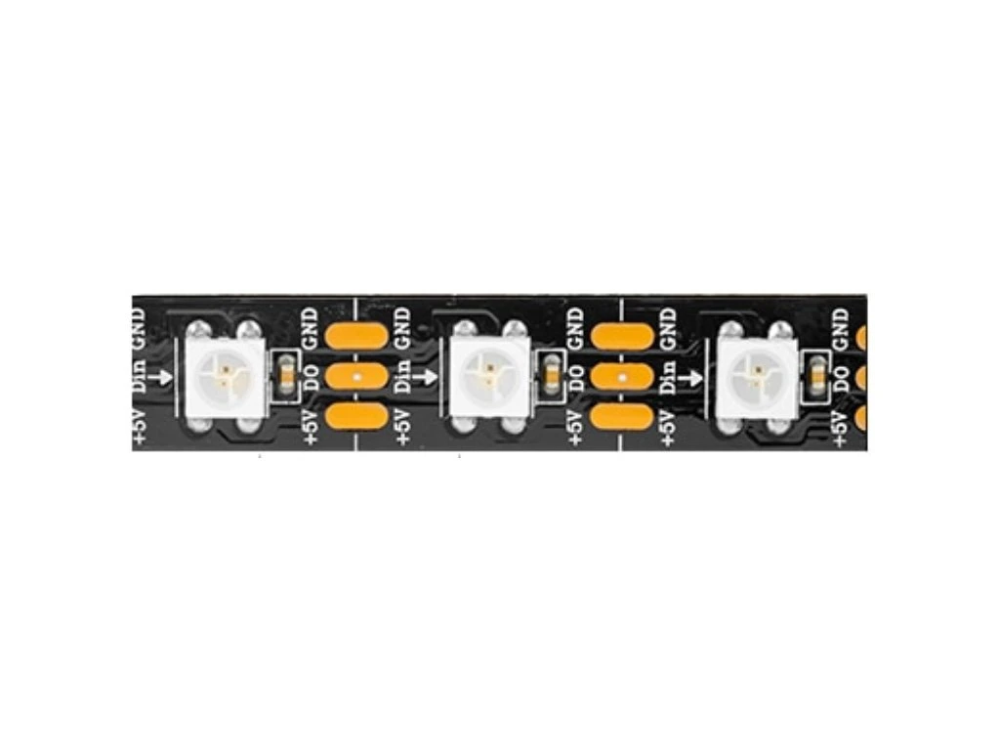

# Documentación de la librería `ws2812b`

## Control de tira LED WS2812B con PIC18F57Q43

Esta documentación describe el funcionamiento, configuración y uso de la librería `ws2812b`, desarrollada para controlar una tira LED direccionable **WS2812B** mediante el microcontrolador **PIC18F57Q43**, usando el compilador **XC8** en **MPLAB X IDE**.

La librería permite controlar varios LEDs WS2812B mediante una sola línea de datos. Cada LED puede recibir un color independiente en formato RGB, aunque internamente la WS2812B requiere que los datos se transmitan en orden **GRB**.


---

## Archivos de la librería

La librería está compuesta por dos archivos principales:

```text
ws2812b.h
ws2812b.c
```

### `ws2812b.h`

Contiene:

- Definiciones generales de la librería.
- Configuración del pin de datos de la tira.
- Macros para controlar la línea DIN.
- Definición de la estructura `LED_WS2812B`.
- Prototipos de las funciones disponibles para el programa principal.

### `ws2812b.c`

Contiene:

- Implementación de la inicialización de la tira.
- Funciones para asignar colores a uno o varios LEDs.
- Funciones internas para enviar bits y bytes a la WS2812B.
- Función de actualización física de la tira.
- Funciones auxiliares para apagar la tira y asignar un color RGB general.

---

## Objetivo de la librería

El objetivo de esta librería es ordenar y simplificar el control de una tira WS2812B dentro del proyecto, evitando escribir directamente la secuencia de transmisión en el archivo principal.

La librería permite:

- Configurar una cantidad definida de LEDs.
- Guardar colores RGB para cada LED.
- Asignar un color a un LED específico.
- Asignar un mismo color a toda la tira.
- Enviar los datos almacenados hacia la tira física.
- Apagar todos los LEDs.
- Encender todos los LEDs con un color RGB personalizado.

---

## Consideración de hardware

La WS2812B no se controla como un LED RGB común. Cada LED contiene un controlador interno y recibe una trama digital por una sola línea de datos llamada **DIN**.

La conexión general es:

```text
PIC18F57Q43 -> DIN WS2812B
GND PIC     -> GND tira LED
5 V externo -> 5 V tira LED
```

Para el funcionamiento correcto del sistema, se debe considerar lo siguiente:

- La tira WS2812B debe alimentarse con una fuente adecuada de 5 V.
- La tierra del PIC y la tierra de la fuente de la tira deben estar unidas.
- La señal de datos debe conectarse al pin **DIN** de la tira, no al pin DOUT.
- Para pruebas iniciales, se recomienda usar pocos LEDs y valores bajos de brillo.
- Si el PIC trabaja a 3.3 V y la tira a 5 V, puede ser necesario usar un conversor de nivel lógico.

---

## Configuración de frecuencia

La librería depende de la frecuencia definida en el archivo `cabecera.h`.

Ejemplo:

```c
#define _XTAL_FREQ 48000000UL
```

Esta definición debe coincidir con la frecuencia real configurada en el oscilador del PIC18F57Q43.

Ejemplo de configuración del oscilador en el archivo principal:

```c
void config(void)
{
    OSCCON1 = 0x60;
    OSCFRQ  = 0x07;
    OSCEN   = 0x40;
}
```

Si la frecuencia declarada en `_XTAL_FREQ` no coincide con la frecuencia real del microcontrolador, los retardos y la señal generada para la WS2812B pueden ser incorrectos.

---

## Configuración del pin de datos

La WS2812B requiere tiempos muy precisos. Por esta razón, la librería no usa punteros para cambiar el pin durante la transmisión. En su lugar, el pin físico se define mediante macros dentro de `ws2812b.h`.

Configuración por defecto:

```c
#define WS2812B_LAT    LATDbits.LATD0
#define WS2812B_TRIS   TRISDbits.TRISD0
#define WS2812B_ANSEL  ANSELDbits.ANSELD0
```

Con esta configuración, la línea de datos DIN de la tira se conecta al pin **RD0**.

Para usar otro pin, se deben modificar estas tres definiciones.

Ejemplo para usar RD1:

```c
#define WS2812B_LAT    LATDbits.LATD1
#define WS2812B_TRIS   TRISDbits.TRISD1
#define WS2812B_ANSEL  ANSELDbits.ANSELD1
```

Ejemplo para usar RB0:

```c
#define WS2812B_LAT    LATBbits.LATB0
#define WS2812B_TRIS   TRISBbits.TRISB0
#define WS2812B_ANSEL  ANSELBbits.ANSELB0
```

---

## Macros de control del pin

La librería usa las siguientes macros para cambiar el estado lógico del pin de datos:

```c
#define WS2812B_HIGH()  WS2812B_LAT = 1
#define WS2812B_LOW()   WS2812B_LAT = 0
```

### `WS2812B_HIGH()`

Coloca la línea DIN en estado alto.

### `WS2812B_LOW()`

Coloca la línea DIN en estado bajo.

Estas macros se utilizan porque la WS2812B requiere tiempos muy precisos. Una función normal o una escritura mediante punteros puede agregar instrucciones adicionales y alterar el ancho de los pulsos.

---

## Cantidad máxima de LEDs

La cantidad máxima de LEDs que puede manejar la librería se define mediante:

```c
#define WS2812B_MAX_LEDS  30
```

Este valor define el tamaño de los arreglos internos de color.

Cada LED requiere 3 bytes de memoria:

```text
1 byte para rojo
1 byte para verde
1 byte para azul
```

Por lo tanto:

```text
30 LEDs x 3 bytes = 90 bytes de RAM
```

Este valor no significa que siempre se usarán 30 LEDs. Solo indica el máximo permitido por la librería.

---

## Estructura `LED_WS2812B`

La estructura principal de la librería es:

```c
typedef struct
{
    uint8_t num_leds;
    uint8_t red[WS2812B_MAX_LEDS];
    uint8_t green[WS2812B_MAX_LEDS];
    uint8_t blue[WS2812B_MAX_LEDS];

} LED_WS2812B;
```

Esta estructura almacena la información de color de la tira.

### Campos de la estructura

#### `num_leds`

Guarda la cantidad real de LEDs conectados a la tira.

#### `red[]`

Arreglo que almacena la intensidad del color rojo de cada LED.

#### `green[]`

Arreglo que almacena la intensidad del color verde de cada LED.

#### `blue[]`

Arreglo que almacena la intensidad del color azul de cada LED.

Aunque los colores se guardan en formato RGB, la transmisión física hacia la WS2812B se realiza en orden GRB.

---

## Orden de color de la WS2812B

Cada LED WS2812B recibe 24 bits:

```text
8 bits para verde
8 bits para rojo
8 bits para azul
```

Por lo tanto, el orden de transmisión es:

```text
G, R, B
```

No es RGB, sino GRB.

Por esa razón, la función `WS2812B_Show()` transmite primero el valor verde, luego el rojo y finalmente el azul.

```c
WS2812B_SendByte(tira->green[i]);
WS2812B_SendByte(tira->red[i]);
WS2812B_SendByte(tira->blue[i]);
```

---

## Funciones públicas de la librería

### `WS2812B_Init()`

```c
void WS2812B_Init(LED_WS2812B *tira, uint8_t num_leds);
```

Inicializa la tira LED WS2812B.

Esta función:

- Configura el pin DIN como digital.
- Configura el pin DIN como salida.
- Coloca la línea de datos en estado bajo.
- Guarda la cantidad real de LEDs conectados.
- Inicializa todos los arreglos de color en cero.

Ejemplo:

```c
LED_WS2812B tira1;

WS2812B_Init(&tira1, 3);
```

En este ejemplo se inicializa una tira de 3 LEDs.

---

### `WS2812B_SetPixel()`

```c
void WS2812B_SetPixel(LED_WS2812B *tira,
                      uint8_t led,
                      uint8_t red,
                      uint8_t green,
                      uint8_t blue);
```

Asigna un color RGB a un LED específico de la tira.

Esta función solo guarda el color en memoria. No actualiza físicamente la tira hasta que se llame a `WS2812B_Show()`.

Ejemplo:

```c
WS2812B_SetPixel(&tira1, 0, 50, 0, 0);
WS2812B_Show(&tira1);
```

En este ejemplo, el LED 0 se enciende en rojo con brillo moderado.

Los valores de color deben estar entre 0 y 255.

---

### `WS2812B_SetAll()`

```c
void WS2812B_SetAll(LED_WS2812B *tira,
                    uint8_t red,
                    uint8_t green,
                    uint8_t blue);
```

Asigna el mismo color RGB a todos los LEDs configurados.

Esta función solo modifica la memoria interna. Para ver el cambio en la tira, se debe llamar a `WS2812B_Show()`.

Ejemplo:

```c
WS2812B_SetAll(&tira1, 0, 50, 0);
WS2812B_Show(&tira1);
```

En este ejemplo, toda la tira se enciende en verde con brillo moderado.

---

### `WS2812B_Show()`

```c
void WS2812B_Show(LED_WS2812B *tira);
```

Envía hacia la tira WS2812B los colores almacenados en memoria.

Esta función recorre todos los LEDs y transmite sus datos en el orden requerido por la WS2812B:

```text
Verde, rojo, azul
```

Al finalizar la transmisión, deja la línea de datos en bajo durante un tiempo de reset para que los LEDs actualicen su estado.

---

### `WS2812B_Clear()`

```c
void WS2812B_Clear(LED_WS2812B *tira);
```

Apaga todos los LEDs de la tira.

Internamente ejecuta:

```c
WS2812B_SetAll(tira, 0, 0, 0);
WS2812B_Show(tira);
```

Ejemplo:

```c
WS2812B_Clear(&tira1);
```

---

### `WS2812B_RGB()`

```c
void WS2812B_RGB(LED_WS2812B *tira,
                 uint8_t red,
                 uint8_t green,
                 uint8_t blue);
```

Enciende todos los LEDs con un color RGB personalizado.

Esta función asigna el mismo color a todos los LEDs y envía inmediatamente el cambio a la tira.

Ejemplo:

```c
WS2812B_RGB(&tira1, 50, 0, 0);
```

Enciende toda la tira en rojo con brillo moderado.

---

## Funciones internas de la librería

Las siguientes funciones son internas y se encuentran en `ws2812b.c`. No se declaran en `ws2812b.h` porque no deben ser llamadas directamente desde el programa principal.

---

### `WS2812B_SendBit()`

```c
static void WS2812B_SendBit(uint8_t bit_value);
```

Envía un bit lógico a la tira WS2812B.

La WS2812B diferencia un bit 0 de un bit 1 por el tiempo que la línea de datos permanece en alto.

```text
Bit 0: alto corto, bajo largo
Bit 1: alto largo, bajo corto
```

Esta función usa `NOP()` para ajustar el tiempo de los pulsos.

---

### `WS2812B_SendByte()`

```c
static void WS2812B_SendByte(uint8_t data);
```

Envía un byte completo hacia la WS2812B.

Los bits se transmiten desde el bit más significativo hasta el bit menos significativo:

```text
bit 7, bit 6, bit 5, bit 4, bit 3, bit 2, bit 1, bit 0
```

---

## Ejemplo de uso en `maincode.c`

```c
#include <xc.h>
#include "cabecera.h"
#include "ws2812b.h"

LED_WS2812B tira1;

void config(void)
{
    OSCCON1 = 0x60;
    OSCFRQ  = 0x07;
    OSCEN   = 0x40;
}

void main(void)
{
    config();

    /*
     * Inicializa una tira de 3 LEDs.
     * El pin de datos se define en ws2812b.h.
     */
    WS2812B_Init(&tira1, 3);

    while(1)
    {
        WS2812B_RGB(&tira1, 200, 0, 0);
        __delay_ms(1000);

        WS2812B_RGB(&tira1, 0, 200, 0);
        __delay_ms(1000);

        WS2812B_RGB(&tira1, 0, 0, 200);
        __delay_ms(1000);

        WS2812B_Clear(&tira1);
        __delay_ms(1000);
    }
}
```

---

## Valores permitidos para color

Cada canal de color usa un dato de tipo `uint8_t`.

Por lo tanto, los valores permitidos son:

```text
0 a 255
```

No se deben usar valores mayores a 255.

Ejemplo incorrecto:

```c
WS2812B_RGB(&tira1, 0, 0, 2000);
```

Ejemplo correcto:

```c
WS2812B_RGB(&tira1, 0, 0, 200);
```

Para pruebas iniciales se recomienda usar valores bajos:

```c
WS2812B_RGB(&tira1, 30, 0, 0);
WS2812B_RGB(&tira1, 0, 30, 0);
WS2812B_RGB(&tira1, 0, 0, 30);
```

---

## Recomendaciones de uso

Para obtener un funcionamiento estable, se recomienda:

- Empezar con pocos LEDs, por ejemplo 3 LEDs.
- Usar valores bajos de brillo durante las primeras pruebas.
- Verificar que el pin de datos esté conectado a DIN y no a DOUT.
- Unir la tierra del PIC con la tierra de la fuente de la tira.
- Usar una fuente de 5 V adecuada para la cantidad de LEDs.
- Evitar modificar los `NOP()` si la librería ya funciona correctamente.
- No usar punteros ni funciones auxiliares dentro de la transmisión de bits.

---

## Consumo aproximado

Un LED WS2812B puede consumir hasta aproximadamente 60 mA cuando está en blanco a brillo máximo.

Estimación:

```text
1 LED  -> hasta 60 mA
3 LEDs -> hasta 180 mA
10 LEDs -> hasta 600 mA
30 LEDs -> hasta 1.8 A
```

El consumo real depende del color y del brillo usado.

---

## Limitaciones de la versión actual

Esta versión de la librería usa transmisión por software mediante bit-banging.

Limitaciones principales:

- El pin se configura mediante macros, no desde `WS2812B_Init()`.
- Los tiempos dependen de la frecuencia real del PIC.
- Los `NOP()` están ajustados para la configuración actual del proyecto.
- Si se cambia la frecuencia del microcontrolador, puede ser necesario recalibrar la transmisión.
- La librería no usa SPI, PWM ni temporizadores para generar la señal.

---

## Resumen de funciones

| Función | Descripción |
|---|---|
| `WS2812B_Init()` | Inicializa la tira y configura el pin DIN. |
| `WS2812B_SetPixel()` | Guarda un color RGB en un LED específico. |
| `WS2812B_SetAll()` | Guarda el mismo color RGB en todos los LEDs. |
| `WS2812B_Show()` | Envía los colores almacenados hacia la tira. |
| `WS2812B_Clear()` | Apaga todos los LEDs. |
| `WS2812B_RGB()` | Enciende toda la tira con un color RGB personalizado. |

---

## Conclusión

La librería `ws2812b` permite controlar una tira LED WS2812B desde el PIC18F57Q43 de forma ordenada y reutilizable. La estructura `LED_WS2812B` almacena los colores de la tira, mientras que las funciones públicas permiten inicializar, asignar colores, actualizar la tira y apagar los LEDs.

Debido a que la WS2812B requiere tiempos muy precisos, la transmisión se realiza mediante macros directas sobre el pin de datos. Esta decisión permite mantener la señal estable y evita los retardos adicionales que pueden aparecer al usar punteros o funciones auxiliares en la parte crítica de comunicación.
